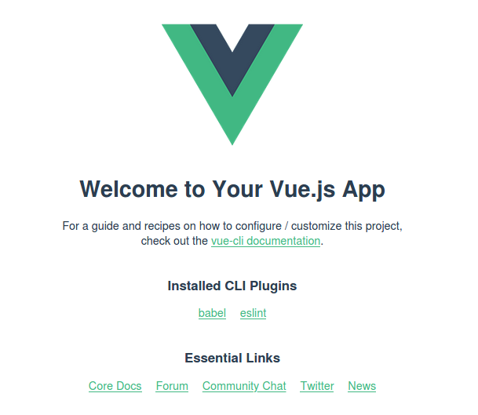

# Установка
переходим в директорию проекта и устанавливаем vue:
```
npm install vue
```
Команда устанавливает исходные файлы в поддерикторию node_modules и создает файл package-lock.json.  

Глобальная установка утилиты vue/cli:
```
npm install -g @vue/cli
```  

|Команда|описание|
|---|---|
| create [options] <app-name> | создать новый проект на основе vue-cli-service |
|add [options] <плагин> [плагинOptions] | установить плагин и вызвать его генератор в уже созданном проекте |
|invoke [options] <plugin> [pluginOptions] | вызывать генератор плагина в уже созданном проекте |
|inspect [options] [paths ...] | проверять конфигурацию webpack в проекте с помощью vue-cli-service |
|serve [options] [entry] | обслуживать файл .js или .vue в режиме разработки с нулевой конфигурацией |
|build [options] [entry] | построить файл .js или .vue в рабочем режиме с нулевой конфигурацией |
|ui [options] | запускает и открывает пользовательский интерфейс vue-cli |
|init [options] <template> | <имя приложения> создать проект из удаленного шаблона (устаревший API, требуется @ vue / cli-init) |
|config [options] [value] | проверить и изменить конфигурацию |
|outdated [options] | (экспериментальная) проверка устаревших vue cli service / plugins |
|upgrade [options] [plugin-name] | (экспериментально) обновить vue cli service / plugins |
|info | print отладочная информация о вашей среде |


Запустите vue <command> --help для подробного использования данной команды.  

Создаем проект в текушей директории:  
``
npm create .
``  
Устанавливаем зависимости:
```
npm install
```
Запускаем сервер:  
```
vue serve src/App.vue
```
```
 DONE  Compiled successfully in 14180ms                                                                                                                                       12:48:20 PM


  App running at:
  - Local:   http://localhost:8080/ 
  - Network: http://192.168.0.2:8080/

  Note that the development build is not optimized.
  To create a production build, run npm run build.

```
  

При установке может возникнуть проблема доступа к директории /usr/lib/node_modules, решил так:
```
sudo chown -R $User /usr/lib/node_modules
sudo chown -R $User /usr/bin
```  
после этого команды запускаются без sudo.